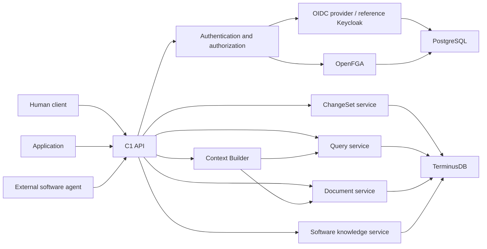
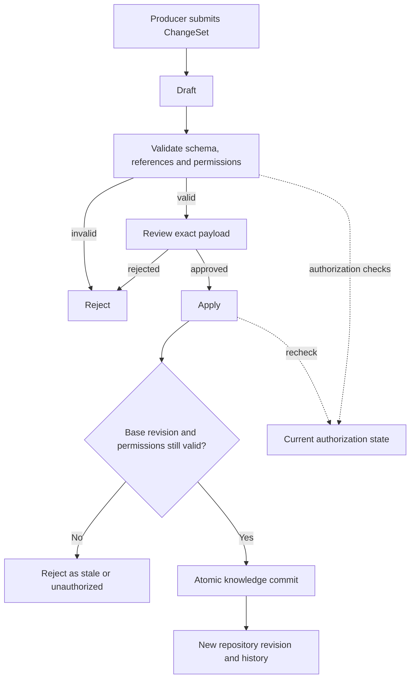
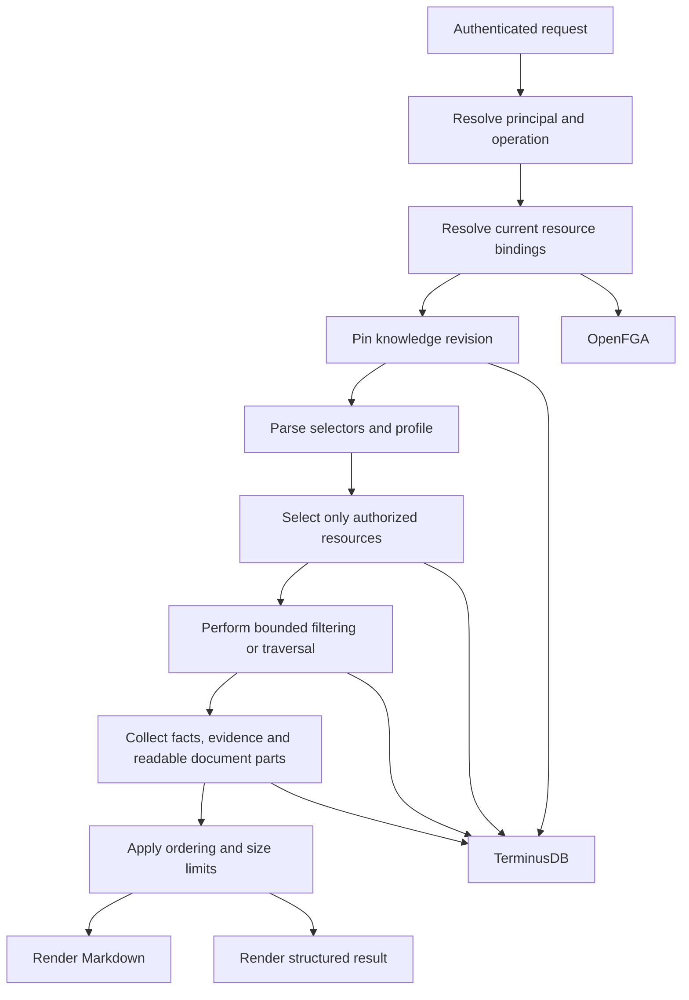
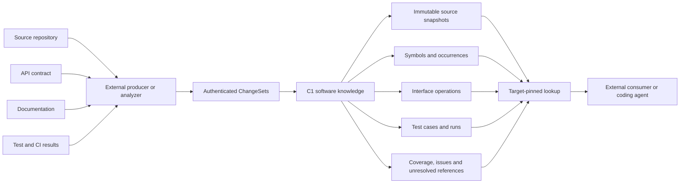
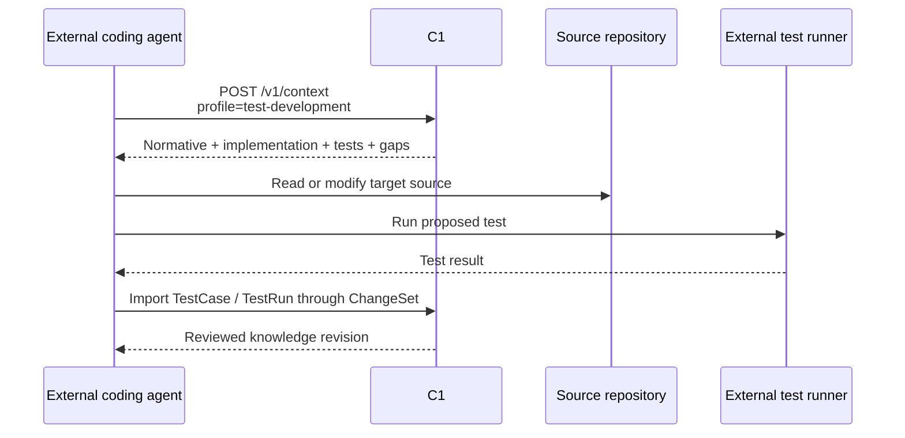
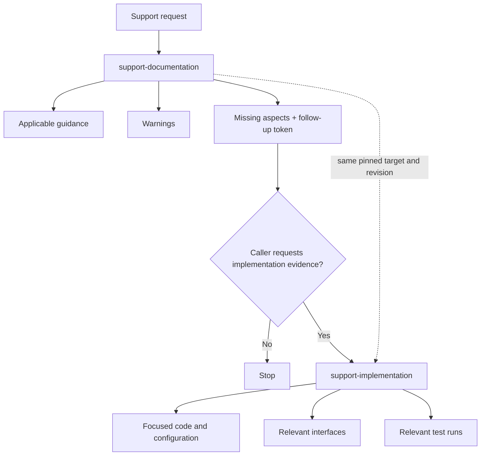
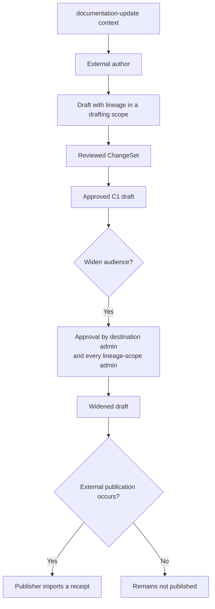

# C1

C1 is an open-source, versioned knowledge framework for people, applications, and external software agents.

A C1 instance uses one shared knowledge repository. It stores attributed claims, evidence, permissions, controlled changes, and version history. It also provides deterministic queries and context retrieval.

The required C1 workflows do not depend on an LLM, embeddings, or an AI-provider key.

For detailed information:

- [PROJECT_SPECIFICATION.md](PROJECT_SPECIFICATION.md) defines the product requirements.
- [MVP_ARCHITECTURE.md](MVP_ARCHITECTURE.md) describes the proposed architecture.
- [PLAN.md](PLAN.md) contains the development roadmap and milestone status.

Development proceeds one milestone at a time.

## Architecture overview

People, applications, and external agents use the same authenticated C1 API.

They do not normally access the knowledge or authorization backends directly.



TerminusDB contains the versioned C1 knowledge repository.

OpenFGA contains current authorization state.

The OIDC provider supplies authenticated identities.

Current authorization state and historical knowledge are separate. An old knowledge revision cannot restore an old permission.

## What exists today

- **Harness:** Python project metadata, a lockfile, Make targets for setup and checks, a clean-start helper, and a GitHub Actions workflow.
- **Model:** Canonical records, bundled JSON-LD and SHACL profiles, exact lexical values, keywords, and time qualifiers. The internal TerminusDB round-trip is verified. See the [M02 report](docs/milestones/M02-report.md).
- **Security:** Authenticated HTTP boundaries, OIDC tokens, current-binding authorization, durable security operations, and crash recovery. These functions passed the real-service gate. See the [M03 report](docs/milestones/M03-report.md).
- **Controlled writes:** ChangeSets, validation, review, atomic application, authorized resource reads, and resource history are implemented and verified.
- **Queries:** Deterministic entity, assertion, source, evidence, export, and graph-neighborhood queries are implemented and verified.
- **Documents:** Authorization-aware document storage, search, reconstruction, rendering, export, and history are implemented and verified.
- **Context:** Deterministic context packages with structured data and Markdown output are implemented and verified.
- **Software knowledge:** Source snapshots, symbols, occurrences, contracts, tests, runs, configurations, target sets, coverage, and related software records are implemented through the data-only software profile.
- **Test-development context:** Target-pinned context for coding agents is implemented. It separates normative material, implementation evidence, tests, test runs, instructions, discrepancies, and gaps.
- **Authorization performance:** Batched current-authorization checks with decision-identical results and bounded backend work are implemented and verified. See the [M09a report](docs/milestones/M09a-report.md).
- **Support context:** Two-stage, documentation-first support context with an explicit follow-up for focused implementation evidence is implemented and verified. See the [M10 report](docs/milestones/M10-report.md).
- **Documentation-update context:** Cross-software documentation-update context, applicability records, quarantined drafts with lineage, lineage-aware audience widening, and publication receipts are implemented and verified. See the [M11 report](docs/milestones/M11-report.md).
- **Baseline:** Repository-local specification and architecture documents with source attribution. The software use-case extension is recorded separately.
- **Checks:** Local checks for code quality, types, tests, secret hygiene, and baseline consistency.
- **CI:** The pinned GitHub Actions workflow passed. The M00 tests also verified an intentional canary failure and the restored successful state. See the [M00 report](docs/milestones/M00-report.md).
- **Conventions:** The repository includes guidance and templates for milestone plans and reports.
- **License:** The repository contains the Apache-2.0 project license and a placeholder for third-party notices.

## Run the harness

Prerequisites:

- Git
- `uv` 0.12 or later
- GNU Make
- Network access for the first dependency sync

Run these commands from the repository root:

```sh
make bootstrap
make check
make clean-start
```

`make bootstrap` installs the locked development environment.

`make check` runs the local checks.

`make clean-start` requires a clean and committed checkout.

To check a temporary snapshot of the current uncommitted work, run:

```sh
bash scripts/clean_start.sh --worktree
```

These commands do not require an AI-provider credential.

## Isolated infrastructure proofs

M01 adds a local experimental stack and test probes outside the product package.

Prerequisites:

- Podman 5.x
- podman-compose
- approximately 4 GB of free RAM

Run:

```sh
make stack-up
make inventory
C1_STACK=1 make probe
make stack-down
```

The first startup downloads pinned images.

The startup process creates random private credentials in `deployment/.env`. Git ignores this file.

The services bind only to the loopback interface.

The tests use synthetic records. They pause and restart the OpenFGA service owned by the test stack. They also remove their test databases and stores.

Run this gate sequentially on the dedicated development stack.

`make stack-down` stops the stack and preserves its volumes.

`make stack-reset` deletes only the development volumes that belong to this stack.

The default `make check` command skips these real-service tests.

See the [M01 plan](docs/milestones/M01.md) for scope and limitations.

## Canonical model development

M02 adds a versioned profile in `profiles/core/` and a synthetic fixture in `fixtures/core-knowledge/`.

The model has no authorization bypass.

Profile checks and pure-model checks are part of:

```sh
make check
```

Run the full real-service regression gate with:

```sh
C1_STACK=1 make integration
```

See the [M02 plan](docs/milestones/M02.md) for the supported subset and accepted decisions.

See the [M02 report](docs/milestones/M02-report.md) for the executed verification evidence.

## Identity and authorization (M03)

M03 adds bearer-token authentication and a current OpenFGA authorization plane.

It also adds:

- journaled scope operations;
- journaled binding operations;
- readiness checks for identity services;
- readiness checks for authorization services;
- readiness checks for storage services.

The probe routes are disabled by default and operate only on synthetic records.

Ordinary knowledge CRUD was outside the M03 milestone scope. It was added by later milestones.

M03 is **VERIFIED**.

The M03 verification included:

- 185 local tests;
- 39 real-service integration tests;
- historical access denial;
- three process crash points;
- identity-service outages;
- authorization-service outages.

See the [M03 report](docs/milestones/M03-report.md) for evidence and limitations.

For a local development demonstration, `make stack-up` starts the pinned services and creates the synthetic identity fixtures.

`make api-up` starts the loopback API with the probe routes explicitly enabled.

This helper is for development only.

The following example uses the generated private credentials without printing an access token:

```bash
uv run --locked python - <<'PY'
import httpx
from probes.config import environment
settings = environment()
with httpx.Client(timeout=10, trust_env=False) as client:
    response = client.post(settings["C1_ISSUER"] + "/protocol/openid-connect/token", data={
        "grant_type": "password", "client_id": "c1-dev-tests",
        "client_secret": settings["C1_DEV_TESTS_SECRET"],
        "username": "alice", "password": settings["C1_USER_ALICE_PASSWORD"],
    })
    response.raise_for_status()
    identity = client.get("http://127.0.0.1:18000/v1/whoami", headers={
        "Authorization": "Bearer " + response.json()["access_token"],
    })
    identity.raise_for_status()
    print(identity.json())
PY
make api-down
```

Run the reproducible two-administrator re-scope demonstration with:

```sh
C1_STACK=1 uv run --locked pytest -q tests/integration/m03/test_t04_historical.py
```

This test verifies denial at the current revision and at the older revision.

The full integration gate also tests real API process crashes and service outages:

```sh
C1_STACK=1 make integration
```

Do not run another development API process during this gate.

When finished, stop the services with:

```sh
make stack-down
```

This command preserves the volumes.

## Reviewed changes and history (M04)

M04 adds:

- ChangeSet drafts;
- validation;
- independent review;
- atomic application;
- authorized resource reads;
- resource history.

M04 is **VERIFIED**.

The [M04 report](docs/milestones/M04-report.md) contains the verified gate results.

The [M04 API notes](docs/milestones/M04-api.md) describe the request contract and access rules.

Ordinary knowledge writes use ChangeSets.

The synthetic probe routes remain a development test surface.

### Controlled write workflow

Normal knowledge writes do not write directly to the active repository state.



Changing the payload after validation invalidates the previous validation and approval.

Application is all-or-nothing.

Authorization is checked again before the ChangeSet is applied.

To run the reviewed-write demonstration against the pinned local services:

```sh
make stack-up
uv run --locked python -m scripts.demo_m04
make stack-down
```

The script creates isolated test databases and an OpenFGA store.

It removes these resources when the test is complete.

The script gets real synthetic user tokens without printing them.

It then prints the ChangeSet receipt and the authorized history list.

You do not need to run `make api-up` for this demonstration.

## Shared identity and queries (M05)

M05 adds a deterministic query API over the shared repository.

M05 is **VERIFIED**.

Authenticated clients can use:

- `/v1/catalog`
- `/v1/entities`
- `/v1/entities/search`
- `/v1/assertions`
- `/v1/sources`
- `/v1/evidence`
- `/v1/export`
- an entity's `/neighborhood` route

Use URL parameters for simple filters.

Use the strict JSON body of `POST /v1/entities/search` for combined entity filters.

Every result is selected under the current resource bindings.

This rule also applies when the client reads an older knowledge revision.

Cursors pin the content revision. C1 checks authorization again when a client continues a cursor request.

See the [M05 plan](docs/milestones/M05.md) for query limits and explicit failure behavior.

See the [M05 execution report](docs/milestones/M05-report.md) for verification results.

The synthetic directory fixture uses one Person ID for Company A and Company B.

Each contact assertion has independent protection.

To load the fixture into the configured local development database and show the authorized IDs and counts for four principals, run:

```sh
make stack-up
uv run --locked python scripts/load_fixture.py --fixture directory --database c1_m03_dev_knowledge
uv run --locked python scripts/demo_m05.py
make stack-down
```

The loader uses local development credentials and authenticated C1 APIs.

Its service principal creates the knowledge ChangeSet.

A separate reviewer approves the ChangeSet.

Use a fresh local stack for a fresh fixture load.

## Scoped documents (M06)

M06 is **VERIFIED**.

Authenticated clients can list and search `/v1/documents`.

Clients can also:

- inspect a document;
- inspect its ordered `/parts`;
- request `/render`;
- request `/export`;
- request `/history`.

Use:

`/v1/documents/by-id?document_id=`

to retrieve a document by an arbitrary canonical IRI.

This path also supports IDs that end in an operation suffix.

Document reconstruction includes only parts that the caller can currently read.

This rule also applies to historical revisions.

C1 preserves the supplied Unicode code points and whitespace.

Each returned part includes the SHA-256 digest of its UTF-8 text.

Markdown rendering neutralizes links and HTML. It also identifies source-code excerpts explicitly.

The [M06 plan](docs/milestones/M06.md) defines:

- the flat part model;
- ordering;
- evidence selectors;
- limits.

The [M06 API notes](docs/milestones/M06-api.md) describe the request and response contracts.

To run the synthetic demonstration:

```sh
make stack-up
uv run --locked python scripts/load_fixture.py --fixture scoped-document --database c1_m03_dev_knowledge
uv run --locked python scripts/demo_m06.py
make stack-down
```

Use a fresh local stack for a fresh fixture load.

The loader uses the normal authenticated ChangeSet path.

Separate credentials identify the author and reviewer.

## Consumer-ready context (M07)

M07 adds the authenticated, read-only `POST /v1/context` path.

M07 is **VERIFIED**.

Versioned local data profiles select authorized paths.

The context operation produces Markdown and equivalent structured data.

The output can include:

- facts;
- excerpts;
- citations;
- qualifiers;
- gaps;
- continuation limits.

Exact keyword filters keep the M05 behavior.

Topic resolution is a separate explicit mode.

Context rendering does not use a model or an AI-provider credential.

### Deterministic retrieval workflow

Authorization is part of retrieval. C1 does not first collect unrestricted data and remove hidden data afterward.



A historical knowledge revision still uses the caller's current authorization.

Hidden resources must not affect visible counts, paths, ordering, explanations, or reconstructed content.

The M07 acceptance gate passed its full real-service verification.

See:

- [M07 plan](docs/milestones/M07.md)
- [M07 API notes](docs/milestones/M07-api.md)
- [M07 execution report](docs/milestones/M07-report.md)

for the implemented scope and verification evidence.

## Software profile and source-version ingestion (M08)

M08 is **VERIFIED**.

M08 adds the data-only software knowledge model and source-version ingestion workflow.

The current software profile is version `1.1.0`. M08 introduced the profile, and M09 later extended it.

The current model includes records for:

- software products;
- code repositories;
- software releases;
- immutable source snapshots;
- capabilities;
- code symbols;
- interface operations;
- symbol occurrences;
- test cases;
- test runs;
- configurations;
- target sets;
- branch observations;
- import coverage;
- import issues;
- unresolved references.

The API includes:

- `POST /v1/software/targets/resolve`
- `POST /v1/software/lookup`

Target resolution uses explicit source snapshots. It does not treat a branch name as immutable evidence.

Software lookup is target-pinned and authorization-aware.

The verified software fixture includes source snapshots, code occurrences, documentation, OpenAPI information, test information, import coverage, and restricted source data.

External deterministic producers prepare and submit software data through the C1 write path.

C1 does not run a compiler, source indexer, test runner, or CI system as part of this feature.

### Software knowledge workflow

Software analysis happens outside C1.

C1 stores the resulting records and evidence.



C1 stores results from external tools. It does not execute those tools as part of the knowledge request path.

See:

- [M08 plan](docs/milestones/M08.md)
- [M08 execution report](docs/milestones/M08-report.md)

for the implemented scope and verification evidence.

## Coding-agent test-development context (M09)

M09 is **VERIFIED**.

M09 adds the `test-development` context profile.

The profile uses the existing `POST /v1/context` endpoint.

A test-development request requires:

- an explicit target;
- an explicit goal;
- an anchor that is a symbol, capability, or interface operation.

The context package can contain:

- normative documentation;
- interface contracts;
- implementation code units;
- direct implementation dependencies;
- test definitions;
- test runs;
- fixtures;
- execution instructions;
- recorded discrepancies;
- gaps;
- evidence-role labels.

The target stays pinned to explicit source snapshots, contracts, and configurations.

Test runs distinguish live, mocked, and other target evidence.

Stored execution instructions are returned as untrusted text.

C1 does not generate tests and does not execute tests.

### Test-development workflow

C1 prepares evidence for an external coding agent. The coding agent performs the development work outside C1.



C1 supplies the evidence package.

The external consumer decides what test to write.

The external runner executes the test.

The result can then return to C1 as source-backed knowledge.

The verified M09 demonstration used an external deterministic consumer. The test failed against the defective source snapshot and passed against the corrected source snapshot. The resulting test records were then imported into C1.

See:

- [M09 plan](docs/milestones/M09.md)
- [M09 execution report](docs/milestones/M09-report.md)

for the implemented scope and verification evidence.

## Batched current-authorization verification (M09a)

M09a is **VERIFIED**.

M09a reduces the backend cost of current authorization checks without changing any security decision.

It adds:

- immutable security views built once per security-journal version;
- one batched decision function used by every single and batched check;
- an exact `bound_to` source that reads per resource or scans the whole authorization store, whichever needs fewer round trips;
- a parse cache for trusted catalog profiles, keyed by file digests.

Decision-equivalence tests compare batched and single-resource decisions under every security state used by earlier milestones. Authorization outages, stalled pagination, and page-cap overruns fail closed.

On the verification host, one software lookup made 14 OpenFGA reads instead of 1,224, and took about 28% less time. ChangeSet review and apply still decide one resource at a time; this is recorded as an open item.

M09a does not change the OpenFGA authorization model or the current-binding rules.

See:

- [M09a plan](docs/milestones/M09a.md)
- [M09a execution report](docs/milestones/M09a-report.md)

## Documentation-first support context (M10)

M10 is **VERIFIED**.

M10 adds two software support context profiles:

- `support-documentation`
- `support-implementation`

The documentation stage returns applicable support documentation first. A newer guide for another target never replaces guidance that applies to the requested target. A guide declared not applicable to the target appears only as a warning, with its evidence.

Requests name support aspects, such as retry or configuration, by exact declared label or ID. Aspects that no returned material addresses are listed as missing. C1 makes no statement about material outside the response.

The implementation stage is a separate, explicit request. It uses a signed follow-up token that pins the same target and C1 revision. It returns only the code, configuration, interfaces, and test runs declared for the requested aspects.



C1 never runs the second stage automatically and makes no sufficiency judgment.

Every package states that read access is not publication permission.

A reader who cannot read the target snapshots receives the same not-found answer as for a target that does not exist.

See:

- [M10 plan](docs/milestones/M10.md)
- [M10 execution report](docs/milestones/M10-report.md)

## Cross-software documentation-update context (M11)

M11 is **VERIFIED**.

M11 adds the `documentation-update` context profile. A request names a capability or interface operation and a target that spans at least two repositories.

The package contains:

- the structure of each existing document, with each part's applicability per target snapshot and every record that contributed to it;
- each repository's responsibilities, linked only by explicit claims;
- the target interface contract and its explicit links;
- configuration and labelled test runs;
- review candidates and recorded discrepancies;
- readable drafts, their lineage, and their publication state;
- compatibility per pair of target snapshots, which stays `unknown` without a matching live test run.

Applicability is always relative to a target snapshot. A missing declaration or record means `unknown`. A document is never marked obsolete globally.

An external rule, `doc-dependency-change/1`, marks documentation parts as review candidates when the contract operation or the implementing code they document changed. A review candidate is not proof that the text is wrong. Only an attributed review can record `contradicted`.



Draft rules:

- a draft is created only in a drafting scope;
- approving a draft requires the latest rule check for exactly its target;
- widening a draft requires independent approval for the destination scope and for every scope its lineage sources come from;
- lineage stays in the drafting scope, so widening never exposes hidden source identifiers;
- only an imported publication receipt marks a draft as published.

C1 does not generate documentation text, merge pull requests, or publish anything.

See:

- [M11 plan](docs/milestones/M11.md)
- [M11 execution report](docs/milestones/M11-report.md)

## Backlog

The tags in this section have these meanings:

- **[PLANNED]** — A detailed milestone plan exists, but the feature is not implemented or verified.
- **[FUTURE]** — The roadmap defines the intended milestone, but a complete implementation plan does not yet exist.

### Roadmap overview

```mermaid
flowchart LR
    M00[M00<br/>VERIFIED] --> M01[M01<br/>VERIFIED]
    M01 --> M02[M02<br/>VERIFIED]
    M02 --> M03[M03<br/>VERIFIED]
    M03 --> M04[M04<br/>VERIFIED]
    M04 --> M05[M05<br/>VERIFIED]
    M05 --> M06[M06<br/>VERIFIED]
    M06 --> M07[M07<br/>VERIFIED]
    M07 --> M08[M08<br/>VERIFIED]
    M08 --> M09[M09<br/>VERIFIED]

    M09 --> M09A[M09a<br/>VERIFIED]
    M09A --> M10[M10<br/>VERIFIED]
    M10 --> M11[M11<br/>VERIFIED]

    M11 --> M12[M12<br/>VERIFIED]
    M12 --> M13[M13<br/>VERIFIED]
    M13 --> M14[M14<br/>VERIFIED]
    M14 --> M14A[M14a<br/>VERIFIED]
    M14A --> M14B[M14b<br/>VERIFIED]
    M14B --> M14C[M14c<br/>VERIFIED]

    M14 --> M15[M15<br/>FUTURE]
    M14C --> M15
    M14 --> M16[M16<br/>FUTURE]
    M16 --> M17[M17<br/>FUTURE]
    M15 --> M18[M18<br/>FUTURE]
    M16 --> M18
```



M00 through M14, including M09a, M14a and M14b, have implementation and verification evidence in their milestone reports.

M14c is verified with both gates and a pinned upstream artifact. M15 through M18 remain optional roadmap work;
M15 requires verified and released M14c. See [PLAN.md](PLAN.md) for current status.

### [VERIFIED] M12 — Human Explorer

M12 added browser workflows using the same secured APIs and context packages.

See the [M12 report](docs/milestones/M12-report.md).

### [VERIFIED] M13 — Release hardening and operational acceptance

M13 qualified the reference deployment, recovery and operational acceptance.
See the [M13 report](docs/milestones/M13-report.md).

### [VERIFIED] M14 — Retrieval and storage benchmark

M14 established reproducible baselines for:

- retrieval quality;
- security isolation;
- data fidelity;
- performance.

See the [M14 report](docs/milestones/M14-report.md). Performance hardening is
recorded separately in [M14a](docs/milestones/M14a-report.md) and
[M14b](docs/milestones/M14b-report.md); their measured limits still apply.

### [VERIFIED] M14c — External OIDC Provider Support

M14c adds provider-independent initialization, explicit approved-user enrollment,
external browser/API authentication, and application-owned guarded recovery.
The reference Keycloak deployment remains supported. Provider administrator roles
never grant C1 permissions.

Read the [installation contract](docs/operations/external-oidc.md),
[recovery procedures](docs/operations/external-oidc-recovery.md), and
[qualification report](docs/milestones/M14c-report.md). Gate A and Gate B passed; the report pins the compatible artifact. M15 remains
unimplemented.

### [FUTURE] M15 — Semantic Seed Index

M15 is an optional post-release extension.

It is intended to add authorization-safe semantic candidate discovery through a rebuildable vector projection.

The semantic index is not intended to become the canonical knowledge store or the authorization authority.

No complete M15 implementation plan exists.

### [FUTURE] M16 — Decision Gate

M16 is an optional post-release extension.

It is intended to add a generic bounded decision interface with optional decision-model providers.

These providers are not intended to become authorities for identity, authorization, truth, or persistence.

No complete M16 implementation plan exists.

### [FUTURE] M17 — Non-generative enrichment

M17 is an optional post-release extension.

It is intended to produce reviewed entity, type, keyword, and resolution proposals from deterministic candidates and optional bounded decisions.

No complete M17 implementation plan exists.

### [FUTURE] M18 — Adaptive hybrid context

M18 is an optional post-release extension.

It is intended to combine optional semantic or gated seed selection with deterministic graph reconstruction and bounded sufficiency retries.

No complete M18 implementation plan exists.

M15 through M18 are optional extensions. They are not required for the core C1 release contract or for the canonical deterministic path.

## Milestone status

Current roadmap status:

- **M00–M11 and M09a:** VERIFIED
- **M12–M18:** FUTURE and not implemented

See [PLAN.md](PLAN.md) for the authoritative scope and status of each milestone.

Roadmap entries describe future acceptance contracts.

A roadmap entry does not mean that the related product feature exists.

It also does not mean that the feature passed verification.

Each implemented milestone has its own plan and evidence report.
